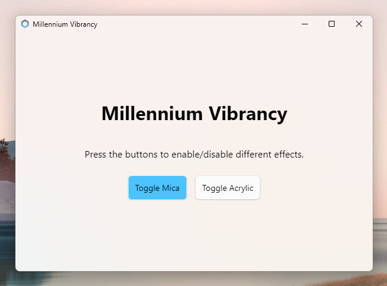
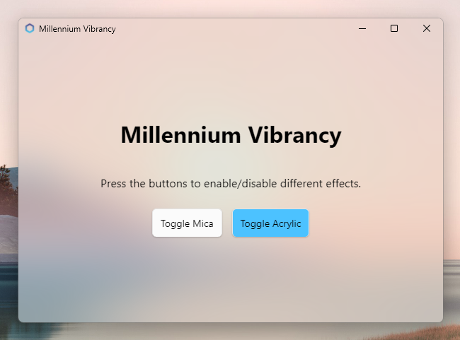
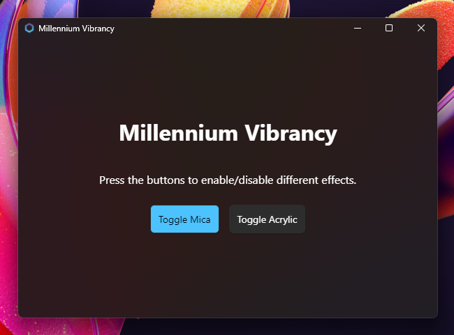
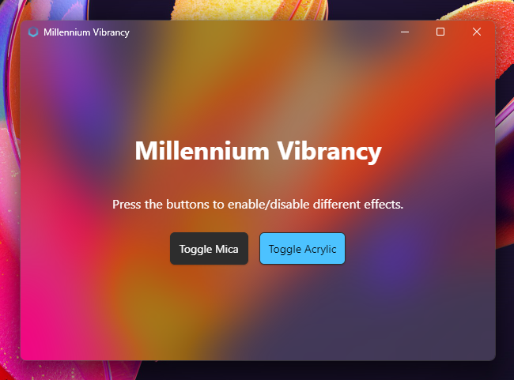

# Millennium Vibrancy Example
This example demonstrates different Windows 11 Acrylic effects using the [`millennium-plugin-vibrancy`](https://crates.io/crates/millennium-plugin-vibrancy) plugin, mutable states, and commands.

`millennium-plugin-vibrancy` also supports macOS Vibrancy effects (hence the name), but were excluded from this demo for brevity.

> ⚠️ **WARNING**: This demo should only be run on Windows 11 builds version 22621 or higher.

